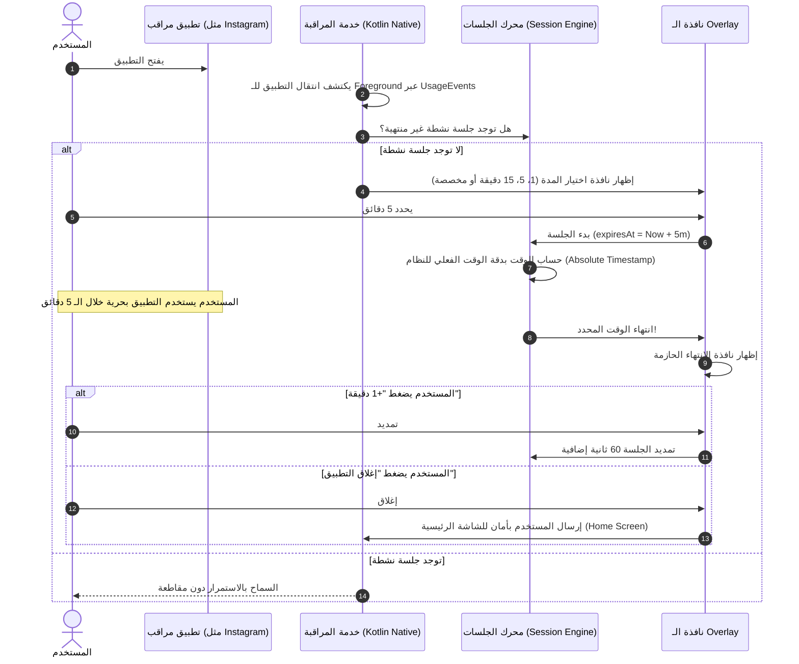

# مسؤول (Mas7ool) — تطبيق التحكم في وقت استخدام تطبيقات التواصل الاجتماعي

<p align="center">
  
</p>

**مسؤول (Mas7ool)** هو تطبيق Android متقدم تم بناؤه باستخدام **Flutter** وطبقة **Native Kotlin** مخصصة، هدفه مساعدة المستخدمين على كسر حلقة التمرير اللانهائي (Doomscrolling) في تطبيقات السوشيال ميديا (مثل Instagram وTikTok وFacebook وYouTube وX وغيرها) عبر فرض جلسات استخدام واعية ومحددة المدة مسبقاً.

---

## 🌟 الفكرة وسير العمل (Core Workflow)



---

## 🏗 المعمارية المعتمدة (Clean Architecture & Feature-First)

تم تصميم المشروع وفق مبادئ **Clean Architecture** الصارمة مع تنظيم **Feature-First**:

```text
lib/
├── core/
│   ├── constants/             # أسماء القنوات، الحزم الشائعة، الثوابت
│   ├── errors/                # معالجة الأخطاء والإخفاقات (Failures)
│   ├── permissions/           # واجهة ومدير الصلاحيات (PermissionManager)
│   ├── providers/             # موفري الاعتمادات عبر Riverpod
│   ├── services/              # جسر NativeBridgeService و NotificationService
│   ├── theme/                 # ثيم Material 3 مع دعم RTL والخطوط العربية
│   └── utils/                 # مسجلات السجلات (AppLogger) ومنسق الأوقات
├── database/
│   ├── app_database.dart      # قاعدة بيانات Drift (SQLite) المعتمدة
│   └── app_database.g.dart    # الأكواد المولدة تلقائياً للجداول والاستعلامات
├── features/
│   ├── dashboard/             # لوحة التحكم الرئيسية، العداد اللحظي، الإحصائيات
│   ├── diagnostics/           # شاشة التشخيص المباشر، حالة الـ State Machine، السجلات
│   ├── monitored_apps/        # استعراض التطبيقات المثبتة وإدارتها والبحث
│   ├── monitoring/            # محرك مراقبة الـ Foreground، آلة الحالات (State Machine)
│   ├── onboarding/            # شاشات الترحيب وإعداد الصلاحيات خطوة بخطوة
│   ├── overlay/               # التحكم بالنوافذ المنبثقة فوق التطبيقات
│   ├── sessions/              # إدارة الجلسات، التمديد، الحساب الدقيق، السجل التاريخي
│   └── settings/              # إعدادات التطبيق ودليل توافق الشركات المصنعة (OEM)
├── shared/
│   └── widgets/               # عناصر الواجهة المشتركة (RtlScaffold, Mas7oolCard, CustomButton)
├── app.dart                   # تكوين GoRouter وMaterialApp
└── main.dart                  # نقطة الانطلاق الرئيسية

android/app/src/main/kotlin/com/mas7ool/mas7ool/
├── MainActivity.kt            # تكوين MethodChannel و EventChannel
├── compatibility/
│   └── ManufacturerHelper.kt  # فك قيود الشركات (Xiaomi, Samsung, Oppo, Huawei, Vivo)
├── monitoring/
│   ├── ForegroundAppDetector.kt     # فاحص UsageStatsManager & UsageEvents مع فلترة
│   └── ForegroundMonitoringService.kt # خدمة Foreground Service المستمرة مع إشعار دائم
├── overlay/
│   └── NativeOverlayManager.kt      # إدارة نوافذ WindowManager TYPE_APPLICATION_OVERLAY
├── permissions/
│   └── PermissionHelper.kt          # فحص الصلاحيات وفتح شاشات الإعدادات الرسمية
└── receivers/
    └── BootReceiver.kt              # استعادة خدمة المراقبة بعد إعادة تشغيل الهاتف
```

---

## 🔒 الصلاحيات وسياسات Android

| الصلاحية | الغرض الأساسي | الطريقة والامتثال |
| :--- | :--- | :--- |
| `PACKAGE_USAGE_STATS` | اكتشاف التطبيق النشط في الـ Foreground | طلب توجيه المستخدم إلى إعدادات `Settings.ACTION_USAGE_ACCESS_SETTINGS` الرسمية. |
| `SYSTEM_ALERT_WINDOW` | عرض الـ Overlay فوق التطبيق فور فتحه وعند انتهاء الوقت | توجيه المستخدم إلى `Settings.ACTION_MANAGE_OVERLAY_PERMISSION`. |
| `FOREGROUND_SERVICE` | إبقاء خدمة المراقبة حية في الخلفية مع إشعار دائم | استخدام نوع `specialUse` / `dataSync` المتوافق مع Android 14 و 15. |
| `POST_NOTIFICATIONS` | عرض الإشعار الدائم وتنبيهات انتهاء الجلسات | التحقق وطلب الإذن على Android 13+. |
| `RECEIVE_BOOT_COMPLETED` | إعادة تشغيل المراقبة بعد إعادة تشغيل الهاتف | تفعيل المراقبة تلقائياً عبر `BootReceiver` إذا كانت مفعلة مسبقاً. |

> [!NOTE]
> **السلوك المتوافق مع سياسات النظام (Safe Exit):**  
> تطبيقات Android العادية لا تملك صلاحيات إغلاق التطبيقات الأخرى قسرياً (`force-stop`). لذلك، عند اختيار المستخدم "إغلاق التطبيق"، يقوم مسؤول بتنفيذ إجراء آمن وقانوني عبر إرسال أمر العودة للشاشة الرئيسية (`Intent.ACTION_MAIN` مع `Intent.CATEGORY_HOME`) وإغلاق الـ Overlay.

---

## ⚙️ آلة الحالات (Monitoring State Machine)

```text
       [ STOPPED ]
            │ (بدء المراقبة)
            ▼
 [ CHECKING_PERMISSIONS ] ──(صلاحيات ناقصة)──> [ STOPPED ]
            │ (الصلاحيات ممنوحة)
            ▼
        [ READY ]
            │ (تشغيل الـ Service و الـ Watcher)
            ▼
       [ WATCHING ] ◄────────────────────────────────────────┐
            │                                                │
            │ (اكتشاف فتح تطبيق مراقَب)                        │
            ▼                                                │
[ MONITORED_APP_DETECTED ]                                   │
            │                                                │
            │ (لا توجد جلسة نشطة)                             │
            ▼                                                │
[ SHOWING_DURATION_OVERLAY ]                                 │
            │                                                │
            │ (المستخدم يختار المدة: 1، 5، 15، مخصص)          │
            ▼                                                │
    [ SESSION_ACTIVE ]                                       │
            │                                                │
            │ (وصول expiresAt إلى الصفر)                      │
            ▼                                                │
   [ SESSION_EXPIRED ]                                       │
            │                                                │
            ▼                                                │
[ SHOWING_EXPIRED_OVERLAY ]                                  │
      │                │                                     │
      │ (+1 دقيقة)      │ (إغلاق التطبيق / Home)               │
      ▼                └─────────────────────────────────────┘
[ SESSION_ACTIVE ]
```

---

## 📱 التوافق مع مختلف الشركات المصنعة (OEM Compatibility)

يحتوي التطبيق على طبقة `ManufacturerHelper` مخصصة ترشد المستخدم إلى الإعدادات الخاصة بجهازه لمنع واجهات النظام المعدلة من قتل الخدمة في الخلفية:

* **Xiaomi / Redmi / POCO (MIUI & HyperOS):**
  * توجيه مباشر لشاشة **AutoStart**.
  * توجيه مباشر لمنح إذن **عرض النوافذ المنبثقة أثناء التشغيل في الخلفية (Display pop-up windows while running in the background)**.
* **Samsung (One UI):**
  * إرشادات إضافة التطبيق إلى قائمة "التطبيقات التي لا توضع في وضع السكون أبداً (Never Sleeping Apps)".
* **Huawei / Honor:**
  * إرشادات تفعيل "التطبيقات المحمية (Protected Apps)" وإدارة بدء التشغيل اليدوية.
* **Oppo / Realme (ColorOS):**
  * تفعيل "السماح بالبدء التلقائي (Allow Auto-Launch)" وإلغاء تجميد الخلفية.

---

## 🧪 الاختبارات وضمان الجودة

المشروع مزود باختبارات وحدوية متكاملة:
* اختبارات دقة حساب التوقيت في `SessionEngine` باستخدام `expiresAt` المطلق.
* اختبارات التمديد (+1 دقيقة) والتأكد من تحديث العداد.
* اختبارات الانتقال السليم بين حالات `MonitoringStateMachine`.
* اختبارات تفادي التكرار عند فتح التطبيقات.
* اختبارات واجهة المستخدم وتكامل الـ Riverpod Providers.

لتشغيل الاختبارات:
```bash
flutter test
```

لفحص الكود:
```bash
flutter analyze
```

---

## 🚀 كيفية تشغيل المشروع

1. تأكد من تثبيت Flutter (الإصدار 3.24+ أو الأحدث) و Android Studio.
2. استرجع الحزم:
   ```bash
   flutter pub get
   ```
3. توليد أكواد Drift و Riverpod:
   ```bash
   dart run build_runner build --delete-conflicting-outputs
   ```
4. تشغيل التطبيق على جهاز Android حقيقي أو محاكي:
   ```bash
   flutter run
   ```

---

## 🛡️ الخصوصية والأمان (Local-First)

* التطبيق يعمل محلياً 100% بدون أي خوادم خارجية.
* لا يتم رفع أي بيانات استخدام أو حزم تطبيقات إلى الإنترنت.
* لا تتم قراءة محتويات الشاشة أو النصوص أو كلمات المرور.
* جميع سجلات الجلسات قابلة للمسح الكامل بضغطة زر واحدة من شاشة الإعدادات.
